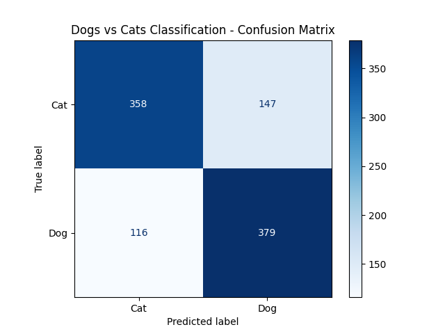

# 🐾 Dogs vs Cats Image Classifier using SVM

This project is part of my Machine Learning internship at **SkillCraft Technology** — Task 3.  
The goal was to implement an image classification model using **Support Vector Machine (SVM)** to distinguish between dog and cat images.

---

## 📂 Project Structure
SCT_ML_3/ ├── confusion_matrix.png # Confusion matrix plot ├── performance_metrics.png # Performance metrics visualization ├── svm_classification_report.txt # Text classification report ├── svm_dog_cat_classifier_grid.pkl # Trained SVM model (Saved with Joblib, LFS) ├── SCT_ML_3.ipynb # Main notebook with code and output └── README.md # Project documentation

---

## 💡 Project Overview

- Dataset: [Dogs vs Cats](https://www.kaggle.com/c/dogs-vs-cats/data) from Kaggle.
- Preprocessing:  
   → Resized images to 128x128.  
   → Converted to grayscale.  
   → Extracted HOG (Histogram of Oriented Gradients) features.  
- Model:  
   → `Support Vector Machine` (SVM) with `GridSearchCV` for hyperparameter tuning.  

---

## 📊 Results

- Best Parameters: `C=1`, `kernel=rbf`, `gamma=scale`
- Cross-Validation Score: **73%**
- Final Test Accuracy: **73.4%**

### 🔥 Confusion Matrix:

### 📈 Classification Report:

Available in [`svm_classification_report.txt`](svm_classification_report.txt).

---

## 💾 Model Usage

The trained model is saved as: svm_dog_cat_classifier_grid.pkl

🧠 What I Learned
Practical image preprocessing using OpenCV and skimage.

Using HOG features for classical image classification.

Hyperparameter tuning using GridSearchCV.

Model saving with compression and Git LFS handling for large files.

📌 Author
Keerthana Dinesh
LinkedIn: @keerthanadinesh95

